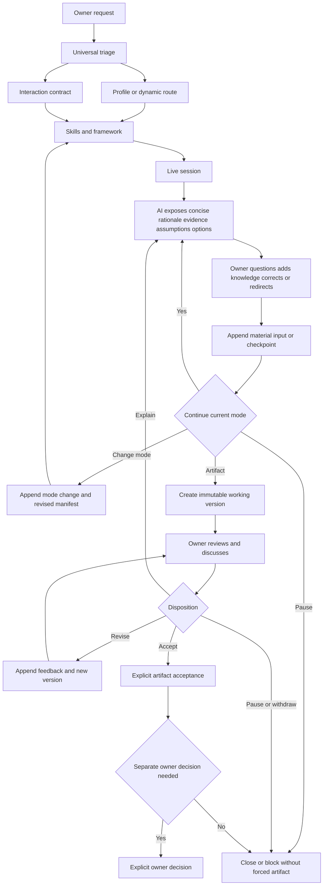
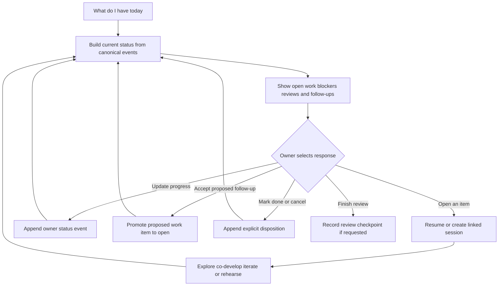

# Vault Next Interaction-First Work Model

Status: Approved design contract; P3A implementation authorized separately  
Date: 2026-09-03  
Scope: Live deliberation, iterative artifacts, working continuity, and chief-of-staff review

## Approved decision

Make the interaction journey a first-class product contract. A Vault Next session may primarily
help the owner understand, challenge, learn, rehearse, or organize work. Producing an artifact is one
possible mode and completion condition, not the universal definition of success.

The repository owner approved this design and ADR-0008 on 2026-09-03, then separately authorized
P3A under the roadmap's exact synthetic-only scope. That authorization does not include P4,
personal profiles/content, adapters, schedulers, connectors, or migration.

## Product outcome

The owner can:

1. begin with familiar language rather than selecting internal skills;
2. explore a subject through questions, explanations, alternatives, challenges, and owner input;
3. see concise evidence, assumptions, trade-offs, disagreements, and skill contributions;
4. move between exploration, co-development, artifact iteration, rehearsal, and status review;
5. review and revise a working artifact through explicit versions before accepting it;
6. pause without forcing an artifact or decision and later resume from repository state;
7. ask what is active today, select an item, update it, and continue the relevant case; and
8. keep artifact acceptance, owner decision, work commitment, and external action distinct.

## Concept boundaries

| Concept | It answers | It does not imply |
|---|---|---|
| Use-case profile | What recurring situation is this? | A fixed skill list or mandatory artifact |
| Interaction mode | How does the owner want to work in this session? | Permission or owner authority |
| Skill | What reusable capability contributes? | Control of the session or persistent agency |
| Framework | How are contributions ordered and reconciled? | A user interaction style by itself |
| Working artifact | What inspectable draft/version is under development? | Acceptance, truth, or owner decision |
| Work item | What proposed or committed follow-up needs attention? | Permission to execute it externally |
| Owner decision | What call did the owner explicitly make? | Artifact acceptance or task completion |

Interaction mode is orthogonal to profile, skills, and framework. A meeting-preparation profile may
begin in exploration, move to artifact iteration for a brief, and finish in rehearsal. Each material
mode change may cause a new skill/framework composition, but it does not create a new case or silently
discard prior contributions.

## Interaction modes

| Mode | Primary outcome | Typical behavior | Artifact policy | Completion signal |
|---|---|---|---|---|
| `explore` | Better understanding | Questions, explanation, evidence gaps, assumptions, options | None or optional checkpoint | Owner pauses, redirects, or says understanding is sufficient |
| `co_develop` | A position or plan developed together | Owner knowledge and skill contributions iteratively reshape the approach | Optional or iterative | Explicit checkpoint accepted or session paused |
| `artifact_iterate` | A reviewed working product | Draft, explain, critique, revise, compare versions | Iterative | Explicit artifact acceptance, withdrawal, or pause |
| `rehearse` | Readiness for a live interaction | Simulation, response, feedback, retry, debrief | Optional notes/brief | Owner ends rehearsal or accepts preparation |
| `status_review` | A current, actionable view | Show active work, blockers, due/review dates, proposed follow-ups; update selected items | Generated current view | Owner finishes review or opens another mode |

Mode selection follows configuration precedence: governance, owner defaults, family profile, named
profile, safe session inference, and explicit owner instruction. The mode source and rationale are
recorded. If intent is unclear but the choice materially changes usefulness, triage may ask one
discriminating question. The one-question triage policy does not limit the substantive questions in
an interactive session.

## Interaction contract

Every Phase 3 `TriagePlan` should add an explicit contract:

```yaml
interaction:
  mode: explore | co_develop | artifact_iterate | rehearse | status_review
  mode_source: owner_instruction | named_profile | family_profile | safe_inference | owner_default
  rationale: <concise visible reason>
  owner_can_change_mode: true
  initiative: owner_led | mixed
  artifact_policy: none | optional | iterative | required
  checkpoint_policy: material_change | owner_request | before_close
  completion_requires:
    - owner_checkpoint | artifact_acceptance | explicit_decision | status_review_complete
  allowed_mode_transitions: [<mode>, ...]
```

Profiles provide defaults and allowed behavior. Triage resolves the actual contract. Skills remain
selected by required work units; a mode is never implemented as a single privileged skill.

## Live session loop



The runtime stores externally useful, concise rationale and provenance. It does not require or store
hidden model chain-of-thought and does not treat the full chat transcript as canonical memory.

## Material conversational records

Not every turn should become a permanent event. Append a semantic record when a turn materially:

- changes the question, scope, interaction mode, or completion condition;
- adds owner knowledge, evidence, a correction, constraint, or preference used in the work;
- creates or changes an assumption, option, disagreement, recommendation, or work item;
- supplies feedback that causes an artifact revision;
- accepts, withdraws, or rejects an artifact;
- records a reasoning checkpoint needed for later continuation; or
- explicitly changes a decision, commitment, priority, blocker, or follow-up status.

Routine phrasing, acknowledgements, and unneeded intermediate model text remain outside canonical
state. The owner may explicitly request that a useful checkpoint be saved.

## Working artifact lifecycle

A working artifact is an immutable content-addressed version plus canonical lineage events. A
replaceable current view may point to the latest valid version, but cannot overwrite version bytes.

```text
artifact proposed
    -> working version created
    -> owner feedback recorded
    -> revised version created
    -> reviewed when required
    -> explicitly accepted | withdrawn | superseded | paused
```

Each version records:

- artifact ID and version ID;
- content hash, media type, and storage reference;
- producing case, session, skill/framework, and source-event watermark;
- relationship to the prior version and concise change summary;
- feedback and review references;
- status: `working`, `review_pending`, `accepted`, `withdrawn`, or `superseded`.

Acceptance means the owner accepts that artifact version for its stated purpose. It does not confirm
every claim, promote durable knowledge, create an owner decision, authorize an external action, or
accept a different version. A changed content hash requires new review and acceptance.

## Owner input and feedback

Owner knowledge must remain distinguishable from evidence and model contribution. Material owner
input records the owner actor, the supplied statement or reference, its intended role, and what later
work derives from it. An AI summary of owner input must remain a derived representation and cannot
replace or expand the owner's authority.

Artifact feedback records the target artifact version, owner or reviewer actor, requested change,
and disposition. A later artifact version links to the feedback it addresses. Unaddressed material
feedback remains visible.

## Chief-of-staff current-work model

The `status_review` mode reads a deterministic current-status projection. It does not scan ambient
chat history or invent tasks from recommendation prose.

The view may contain:

- active and blocked cases;
- active, paused, review-pending, and recently closed sessions;
- explicit work items and their status, due date, next-review date, case, and provenance;
- unresolved assumptions, disagreements, review findings, and owner-requested follow-ups;
- accepted artifacts awaiting an explicit next action;
- consequential actions that were proposed, denied, approved, attempted, or completed; and
- concise source links and the projection watermark.

Introduce a semantic `work_item` distinct from an operational action:

| Work-item status | Authority meaning |
|---|---|
| `proposed` | AI or owner suggestion; not an owner commitment |
| `open` | Explicitly accepted by the owner as work to track |
| `in_progress` | Owner explicitly began or confirmed progress |
| `waiting` | Blocked on a named condition or party |
| `done` | Explicit owner completion or approved authoritative source |
| `cancelled` | Explicitly discontinued without implying completion |

The AI may propose a work item. Only an explicit owner event promotes it to an owner commitment,
changes priority, or marks it done/cancelled. Tracking a work item grants no permission to send,
schedule, publish, edit an external system, or execute the underlying action.

## Daily review journey



“Today” uses the owner's configured time zone and explicit due/next-review metadata. Without an
approved calendar/task connector, it remains a repository-local view. Proactive reminders,
background monitoring, and external task/calendar synchronization are separate future capabilities.

## Mode changes and recomposition

A material mode change appends `interaction.mode_changed`, identifies the prior and new contracts,
and creates the next full manifest version. Triage/composer may then revise skills and framework.
The original route, contributions, artifact versions, permissions, and context remain reconstructible.

Recomposition must:

- use only approved active package versions;
- state added/removed skills and the unique contribution of each selected skill;
- re-check conflicts, framework compatibility, permissions, and authorized context;
- never make removed skills appear to have produced later work; and
- preserve the owner instruction that caused the mode change.

## Approved semantic additions

| Event | Purpose |
|---|---|
| `interaction.started` | Record the resolved interaction contract |
| `interaction.mode_changed` | Record an explicit or safely confirmed material mode change |
| `checkpoint.recorded` | Preserve an externally useful reasoning state for continuation |
| `owner_input.recorded` | Attribute material owner knowledge, correction, constraint, or direction |
| `artifact.version_created` | Register an immutable working artifact version |
| `artifact.feedback_recorded` | Link review/owner feedback to an exact artifact version |
| `artifact.accepted` | Record explicit owner acceptance of an exact version and purpose |
| `artifact.withdrawn` | Stop use of a version without erasing it |
| `work_item.recorded` | Create a proposed or owner-authored work item |
| `work_item.status_changed` | Record explicit commitment/progress/waiting/done/cancelled status |

These are additions to the existing event vocabulary. They do not weaken Phase 1 validation,
append-only history, policy, actor authority, or approval binding.

## Cross-phase impact

| Phase | Required amendment | Effect on completed evidence |
|---|---|---|
| P0 design | Add interaction-first product objective, concepts, invariants, and journeys | Additive clarification |
| P1 contracts/kernel | Later add schemas and actor/reference checks for new event types and artifact hashes | Existing P1 evidence remains valid |
| P2 case/session runtime | Add interaction contract to manifests, mode/checkpoint/owner-input events, artifact/work-item continuity | Existing P2 lifecycle remains valid; additive implementation needed |
| P3 triage/composer | Resolve mode and artifact policy; allow governed recomposition on mode change | Reopen P3 gate for amendment tests before final approval |
| P4 projections | Add working-artifact lineage, interaction journey, current work, and daily status projectors | Material scope clarification |
| P5 review/evaluation | Review exact artifact versions and interaction checkpoints without controlling conversation | Add review fixtures and latency/failure behavior |
| P5A personal profiles | Require owner-approved default interaction behavior and mode fixtures per profile | Material profile acceptance criterion |
| P6 migration | Map historical tasks/artifacts only as attributed history; never infer active commitments | Add mapping/exception rules |
| P7 pilot | Include one interactive journey, one revised artifact, and one daily review | Expand pilot evidence |
| P8 adapters | Provide live mode changes, review/revision controls, and status-review entry points | Material adapter requirement |

No completed phase needs to be discarded. P1 remains the integrity foundation. P2 and P3 require
additive extensions followed by regression evidence. P4 and later phases must be amended before they
are authorized.

## Guardrails

- Artifact generation, feedback, acceptance, owner decision, work commitment, and external action
  are distinct events with distinct authority.
- A model cannot accept an artifact on behalf of the owner or infer acceptance from conversational
  praise, silence, continued use, or session closure.
- A model cannot mark proposed work as committed/done from its own recommendation.
- A mode change cannot expand context or permissions without the normal authorization path.
- A status view cannot create or mutate canonical state merely by being generated.
- A resumed session loads only manifest-authorized context and explicit checkpoints.
- No hidden chain-of-thought, full-transcript dependency, persistent agent, or platform-specific
  memory becomes canonical.
- Proactive/background operation and external synchronization remain out of scope until separately
  designed and approved.

## Approved implementation boundary

Insert a design-gated milestone `P3A — Interaction-first session and working-artifact contracts`
before P4. P3A should implement only synthetic contracts and fixtures for interaction mode,
mode-change recomposition, owner input/checkpoints, artifact version/feedback/acceptance, and work
items. P4 then projects those records into usable artifact histories, case journals, and daily status.

P3A implements this boundary using synthetic fixtures. P4 remains subject to separate evidence
review and explicit authorization.

## Owner design-clearance checklist

The owner accepted each design-clearance point on 2026-09-03:

1. Accept the five initial interaction modes and keep mode orthogonal to profile, skill, framework,
   and artifact.
2. Accept material checkpoints and owner-input events as durable continuity, while excluding hidden
   chain-of-thought and full-transcript dependence.
3. Accept immutable artifact versions and exact-version owner acceptance as distinct from an owner
   decision, work commitment, promotion, and external-action approval.
4. Accept repository-local work items, with AI-created items remaining `proposed` until explicit
   owner commitment and with no implied external execution permission.
5. Accept P3A as the repair point for additive P1/P2/P3 contracts and synthetic tests before P4.
6. Accept the expanded responsibilities for P4, P5, P5A, P6, P7, and P8 in the roadmap.
7. Accept AT-030 through AT-034 as the observable release contract.

The owner separately supplied that exact P3A build authorization. No approval transfers to P4 or
any personal-content, model, adapter, connector, scheduler, or migration scope.
